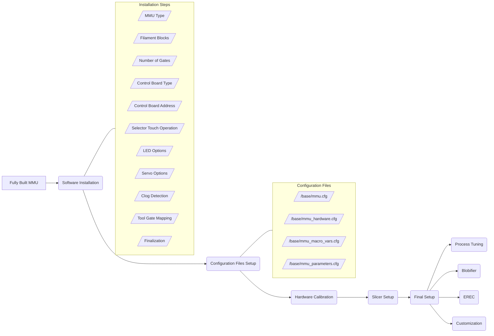

# Happy Hare Wiki

  

##    Documentation and basic walkthrough for successfully setting up your MMU.
This wiki serves to provide a logical set of instructions and FAQs to help you delve into the wonderful world of multi-material printing controlled by the extensive software suite Happy Hare.

##    How to get help
### Look at the troubleshooting page first
There are a few recurring problems with simple solutions and we've tried our best to compile them here:  
[Happy Hare Troubleshooting Guide](https://github.com/IRTrail/Happy-Hare/wiki/Troubleshooting-and-Common-Issues)  

### Discord  
If you don't find the answer there, speak up on the [Voron ERCF Discord channel](https://discord.com/channels/460117602945990666/909743915475816458). There is a lot going on there, so be patient and persistent. Don't give up and someone will certainly help you.
Another avenue is the [the ERCF V2 Github Discussion Board,](https://github.com/Enraged-Rabbit-Community/ERCF_v2/discussions), however, it is not as well monitored as the Discord channel.  

When you ask for help you should be prepared to provide the following information:
- klippy.log
- mmu.log
- version information (copy output from `MMU_STATUS SHOWCONFIG=1`)
- specific error text (copy and paste out of Mainsail would work)
- a detailed description of what has occurred
- details about what was happening when the error occurred
- detailed pictures of the issue if it is physical in nature

Also, **be respectful**. The team works diligently to advance the hardware and software. Direct messaging them is frowned upon and you'll not be moved to the front of the queue by doing so.

Hint:
The easiest way to get logs is to download them through Mainsail. Click the "Machine" tab, then in the dropdown at the top, select "logs". Then look for the chosen log file and RIGHT click and select download.

##    Organization
The Wiki is organized to be as organic in nature as possible. The goal is to help you go step by step from having the MMU hardware built to a fully functioning setup. Since Happy Hare is intended to work for multiple MMUs, please consult the respective resources for hardware sourcing, building, and printed parts requirements.  

Supported MMU types:
* ERCF v1.1
* ERCF v2.0
* Tradrack v1.0
* Generic MMU (basic setup files only)

### General overview of the configuration and setup process:

On the right of the page is an index of pages for each step in the process. Navigate to them for a breakout description of the step and instructions to accomplish each step.

##    Commonly used terms, abbreviations, and their meanings.
This is just a list of some common terms that are thrown around the 3D printing community and by Linux geeks. Now, you'll kinda know what they're talking about!
- rpi: Just a short name for [Raspberry Pi](https://en.wikipedia.org/wiki/Raspberry_Pi), which is a single board computer which runs Klipper.
- ssh: This stands for "[Secure Shell](https://en.wikipedia.org/wiki/Secure_Shell)". It's a remote terminal, or a way to access one computer remotely. Basically, using [PuTTY](https://putty.org/) or even [Windows Power Shell](https://learn.microsoft.com/en-us/powershell/scripting/learn/remoting/ssh-remoting-in-powershell?view=powershell-7.4), you can log into the rpi computer and run it as if you were actually plugged in with a keyboard and monitor.
- git: [Git](https://en.wikipedia.org/wiki/Git) is a version control system which helps track changes between computers. For us in the 3D printing community, this means we can keep our local files up to date with the latest files released. Git seems difficult at first, but it makes things so much easier in the long run.
- GitHub: [GitHub](https://en.wikipedia.org/wiki/GitHub) is a development platform which allows users to store, manage revisions, and collaborate. It uses git software and has a web interface.
- aplhabetized list: A device which puts different items in a list which is logical for humans to understand. This isn't one of those.
- bash: [Bash](https://en.wikipedia.org/wiki/Bash_(Unix_shell)) is a Linux shell which handles user inputs and translates them from one confusing language (Linux commands) to another far more confusing language (computer machine code). If you want to see which shell you're using, just type `echo $0` at the prompt, and it will likely return `bash`.
- bash script: A file containing a bunch of "scripted" commands, which the shell executes in order.

##    Happy Hare General Operation
First, let's take a moment to understand what Happy Hare is and gain a basic understanding of how it works.  

Happy Hare software is modular in nature and works as a "[State Machine](https://en.wikipedia.org/wiki/Finite-state_machine)" in that it manages the state of the MMU and the transitions between states. This means that most parameters can be changed during runtime, or if you will, while in operation.  

If you're not a software and automation expert, you can think of Happy Hare as a browser plugin and Klipper as the browser. Just like Chrome, Edge, et. al. functionality can be expanded with plugins, Happy Hare expands the functionality of Klipper. In the same way that an ad blocker doesn't change how the browser works internally, but filters out annoyances buy __changing the state__ of the data the browser uses, Happy Hare works with Klipper to change the state of the ERCF hardware. That's the basic idea of how Happy Hare works.  

[More detailed information is here.](https://github.com/IRTrail/Happy-Hare/wiki/Conceptional-MMU-Designs-and-how-Happy-Hare-manages-them)

##    Setup and installation pages
These are links to the setup and installation pages. They're broken out into individual pages because this one would be longer than a linear algebra lecture otherwise. So, grab a cup of coffee and work your way down the list.
  
### Software installation
[Happy Hare Software Installation Wiki](https://github.com/IRTrail/Happy-Hare/wiki/Software-Installation-Wiki)  

### Configuration Files Setup  
Here, we'll walk through the configuration files and how the settings affect the performance of the ERCF.  

It's worthwhile to note that there are only a few configuration files that are user editable. You'll notice a whole bunch more files that aren't user editable. The only files we need to worry about are:

 - [/base/mmu.cfg](https://github.com/IRTrail/Happy-Hare/wiki/mmu.cfg-Wiki)
 - [/base/mmu_hardware.cfg](https://github.com/IRTrail/Happy-Hare/wiki/mmu_hardware.cfg-Wiki)
 - [/base/mmu_macro_vars.cfg](https://github.com/IRTrail/Happy-Hare/wiki/mmu_macro_vars.cfg-Wiki)
 - [/base/mmu_parameters.cfg](https://github.com/IRTrail/Happy-Hare/wiki/mmu_parameters.cfg-Wiki)

These files contain all the user editable parameters for the basic MMU setup. Other folders have things for additional functionality like the [Blobifier](https://github.com/Dendrowen/Blobifier), [EREC](https://github.com/kevinakasam/ERCF_Filament_Cutter), etc. They'll be part of a different section.  
